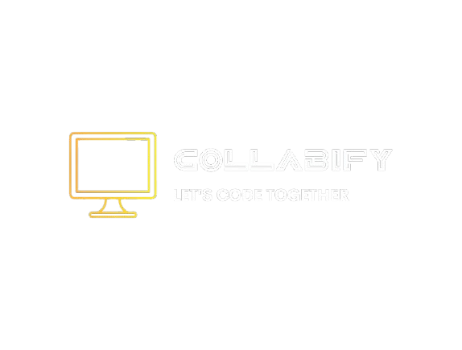

# 🚀 Collabify – Real-Time Code Collaboration Platform

Collabify is a real-time collaborative code editor that enables multiple users to join a shared room and write code together seamlessly. It uses Socket.IO for instant synchronization, making it ideal for coding interviews, pair programming, and collaborative learning.

[](https://collabify-three.vercel.app)
[](https://github.com/your-username/Collabify)

A real-time collaborative code editor built with React, Express, and Socket.IO.
---


## 📸 Preview

> Add screenshots or a demo GIF here



---

## ✨ Features

- 🔗 Create and join unique collaboration rooms
- 👥 Real-time multi-user code synchronization
- ⚡ Instant updates using Socket.IO
- 🆔 UUID-based room generation
- 🎉 Toast notifications for better user experience
- 👤 Live participant management
- 🔄 Automatic code synchronization for newly joined users
- 📱 Responsive and clean UI

---

## 🛠️ Tech Stack

### Frontend
- React.js
- React Router DOM
- Bootstrap
- CodeMirror
- Socket.IO Client
- React Hot Toast
- React Avatar
- UUID


### Backend
- Node.js
- Express.js
- Socket.IO

---

## 📂 Project Structure

```text
Collabify/
│
├── client/
│   ├── public/
│   │   └── images/
│   ├── src/
│   │   ├── component/
│   │   │   ├── Client.js
│   │   │   ├── Editor.js
│   │   │   ├── EditorPage.js
│   │   │   └── Home.js
│   │   ├── socket.js
│   │   ├── App.js
│   │   └── index.js
│   ├── .env
│   └── package.json
│
├── server/
│   ├── index.js
│   └── package.json
│
├── .gitignore
├── README.md
└── structure.txt
```

---

## ⚙️ Installation

### 1. Clone the repository

```bash
git clone https://github.com/your-username/Collabify.git

cd Collabify
```

### 2. Install Frontend Dependencies

```bash
cd client
npm install
```

### 3. Install Backend Dependencies

```bash
cd ../server
npm install
```

---

## ▶️ Run the Project

### Start Backend

```bash
cd server
npm start
```

Server runs on:

```
http://localhost:5000
```

### Start Frontend

```bash
cd client
npm start
```

Frontend runs on:

```
http://localhost:3000
```

---

## 🔄 How It Works

1.Open the app in your browser via the React dev server.
2. User enters a username.
3. User creates or enters an existing Room ID.
4. Socket.IO establishes a real-time connection.
5. Every code change is instantly broadcast to all users in the room.
6. New participants automatically receive the latest code state.
7. Users leaving the room are removed from the participant list.

---

## 📡 Socket Events

### Client → Server

- `join`
- `code-change`
- `sync-code`

### Server → Client

- `joined`
- `code-change`
- `disconnected`

---

## 🚀 Future Improvements

- 💻 Multi-language support
- ▶️ Code execution
- 🎥 Video & voice calling
- 💬 In-room chat
- 📝 Shared notes
- 🌙 Dark/Light theme
- 📋 Collaborative whiteboard
- 🔐 Authentication
- 💾 Save code history
- ☁️ Cloud storage integration

---

## 🤝 Contributing

Contributions are welcome!

1. Fork the repository

2. Create a new branch

```bash
git checkout -b feature-name
```

3. Commit your changes

```bash
git commit -m "Add feature"
```

4. Push to your branch

```bash
git push origin feature-name
```

5. Open a Pull Request

---

## 📄 License

This project is licensed under the MIT License.

---

## 👩‍💻 Author

**Aanya Soni**

- MERN Stack Developer
- DSA Enthusiast
- Open Source Contributor

If you found this project useful, consider giving it a ⭐ on GitHub!
